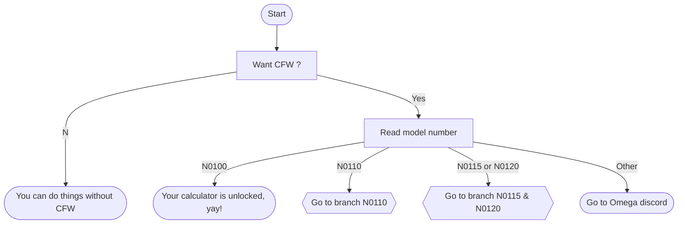
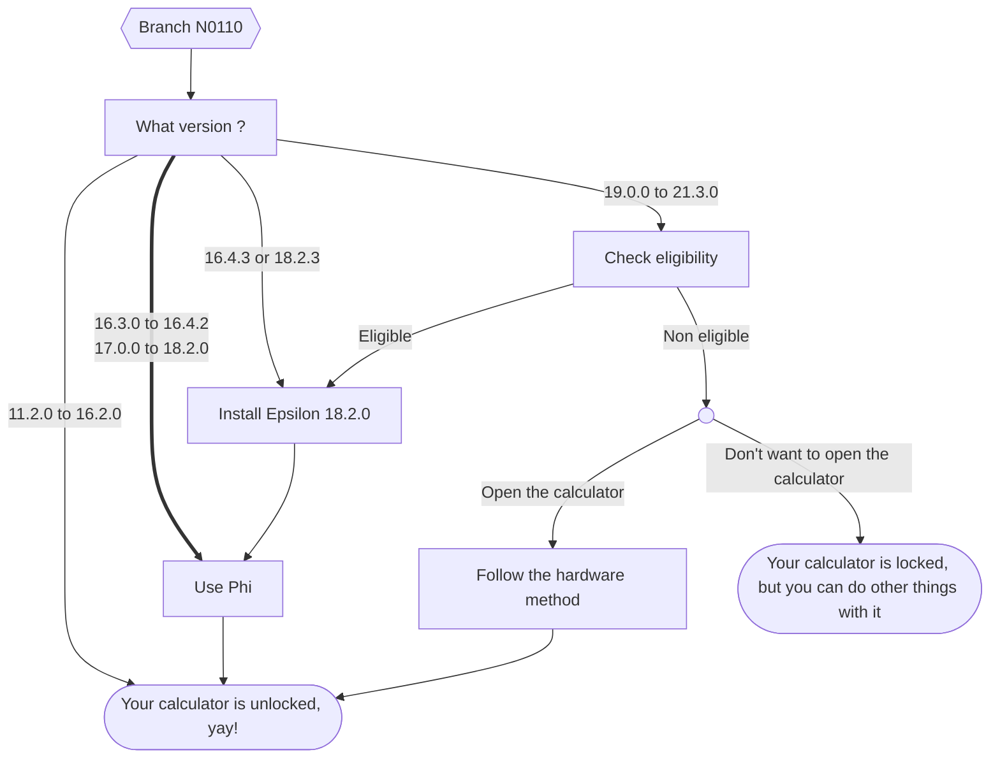
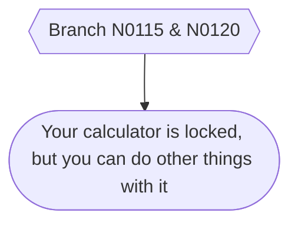

:::info
This is not translated in other languages than English (yet !)
:::

# Main branch

```mermaid
flowchart TD
    calc_unlocked([Your calculator is unlocked, yay!])
    calc_locked([You can do things without CFW])
    start([Start]) --> want_cfw[Want CFW ?]
    want_cfw --No--> calc_locked
    want_cfw --Yes--> model_number[Read model number]
    
    
    model_number --N0100--> calc_unlocked
    model_number --N0110--> branch_N0110{{Go to branch N0110}}
    model_number --N0115 or N0120--> branch_new_calcs{{Go to branch N0115 & N0120}}
    model_number --Other--> goto_discord([Go to Omega discord])

    click model_number "./intro"
    click calc_locked "./no-custom/what-to-do-locked"
    click calc_unlocked "./cfw/choose-a-cfw"
    click goto_discord "https://discord.gg/X2TWhh9"
    click branch_N0110 "#n0110"
    click branch_new_calcs "#new-calcs"
```

# Branch N0110 {#n0110}

```mermaid
flowchart TD
    calc_unlocked([Your calculator is unlocked, yay!])
    calc_locked([Your calculator is locked, but you can do other things with it])
    start{{Branch N0110}} --> check_version[What version ?]
    check_version --11.2.0 to 16.2.0--> calc_unlocked
    check_version ==16.3.0 to 16.4.2\n17.0.0 to 18.2.0==> phi[Use Phi]
    check_version --16.4.3 or 18.2.3--> install_18_2_0[Install Epsilon 18.2.0]
    check_version --19.0.0 to 21.3.0--> downgrade_check[Check eligibility]
    downgrade_check --Eligible--> install_18_2_0
    downgrade_check --Non eligible--> downgrade_fail(( )) --Open the calculator--> hardware_method[Follow the hardware method]
    downgrade_fail --Don't want to open the calculator--> calc_locked
    install_18_2_0 --> phi
    phi & hardware_method --> calc_unlocked

    click check_version "./n0110/n0110-is-locked"
    click downgrade_check "./n0110/phi/check-version-change-eligibility"
    click install_18_2_0 "./n0110/phi/install-epsilon-18-2-0"
    click phi "./n0110/phi"
    click hardware_method "./n0110/hardware/n0110-hardware-unlock"
    click calc_locked "./no-custom/what-to-do-locked"
    click calc_unlocked "./cfw/choose-a-cfw"
```

# Branch N0115 & N0120 {#new-calcs}

```mermaid
flowchart TD
    calc_locked([Your calculator is locked, but you can do other things with it])
    start{{Branch N0115 & N0120}} --> calc_locked

    click calc_locked "./no-custom/what-to-do-locked"
```