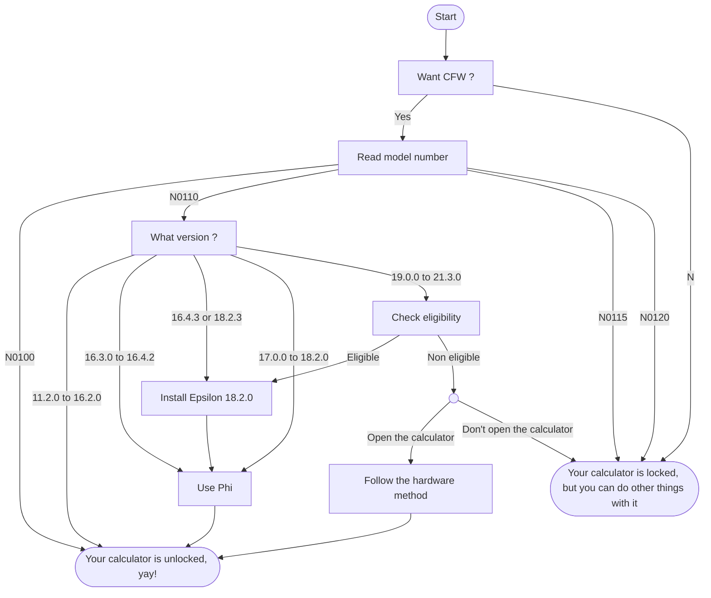

:::info
This is not translated in other languages than English (yet !)
:::

```mermaid
flowchart TD
    calc_unlocked([Your calculator is unlocked, yay!])
    calc_locked([Your calculator is locked, but you can do other things with it])
    start([Start]) --> want_cfw[Want CFW ?]
    want_cfw --Yes--> model_number[Read model number]
    want_cfw --No--> calc_locked
    model_number --N0100--> calc_unlocked
    model_number --N0110--> check_version[What version ?]
    model_number --N0115--> calc_locked
    model_number --N0120--> calc_locked
    check_version --11.2.0 to 16.2.0--> calc_unlocked
    check_version --16.3.0 to 16.4.2--> phi[Use Phi]
    check_version --16.4.3 or 18.2.3--> install_18_2_0[Install Epsilon 18.2.0]
    check_version --17.0.0 to 18.2.0--> phi
    check_version --19.0.0 to 21.3.0--> downgrade_check[Check eligibility]
    downgrade_check --Eligible--> install_18_2_0
    downgrade_check --Non eligible--> downgrade_fail(( )) --Open the calculator--> hardware_method[Follow the hardware method]
    downgrade_fail --Don't open the calculator--> calc_locked
    install_18_2_0 --> phi
    
    phi & hardware_method --> calc_unlocked
```