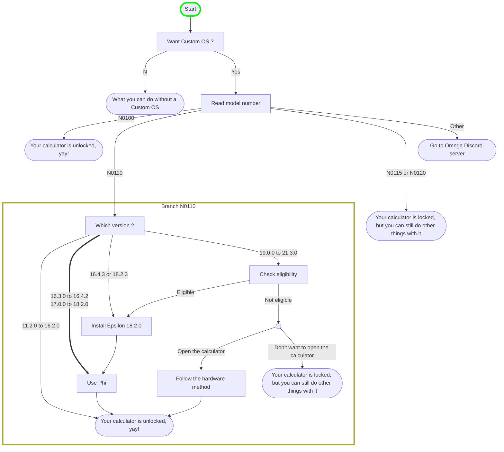

```mermaid
flowchart TD

    calc_unlocked([Your calculator is unlocked, yay!])
    calc_locked_no_modif([What you can do without a Custom OS])
    calc_locked_new_calcs([Your calculator is locked, but you can still do other things with it])

    start([Start]) --> want_cfw[Want Custom OS ?]
    style start stroke:#00f500,stroke-width:4px
    want_cfw --No--> calc_locked_no_modif
    want_cfw --->|Yes| model_number[Read model number]
    
    
    model_number --N0100--> calc_unlocked
    model_number ---->|N0110| check_version_n0110
    model_number ---->|N0115 or N0120| calc_locked_new_calcs
    model_number --Other--> goto_discord([Go to Omega Discord server])


    subgraph n0110 [Branch N0110]
    style n0110 fill:transparent,stroke-width:4px
    calc_locked_n0110([Your calculator is locked, but you can still do other things with it])
    calc_unlocked_n0110([Your calculator is unlocked, yay!])
    check_version_n0110[Which version ?]

    check_version_n0110 --11.2.0 to 16.2.0--> calc_unlocked_n0110
    check_version_n0110 ==16.3.0 to 16.4.2\n17.0.0 to 18.2.0==> phi[Use Phi]
    check_version_n0110 --16.4.3 or 18.2.3--> install_18_2_0[Install Epsilon 18.2.0]
    check_version_n0110 --19.0.0 to 21.3.0--> downgrade_check[Check eligibility]

    downgrade_check --Eligible--> install_18_2_0
    downgrade_check --Not eligible--> downgrade_fail(( )) --Open the calculator--> hardware_method[Follow the hardware method]
    downgrade_fail --Don't want to open the calculator--> calc_locked_n0110

    install_18_2_0 --> phi

    phi & hardware_method --> calc_unlocked_n0110


    click model_number "/docs/intro"
    click calc_locked_no_modif "unlock/what-to-do-locked"
    click calc_unlocked "/docs/cfw/choose-a-cfw"
    click goto_discord "https://discord.gg/X2TWhh9"

    click check_version_n0110 "/docs/unlock/n0110-is-locked"
    click downgrade_check "/docs/unlock/phi/check-version-change-eligibility"
    click install_18_2_0 "/docs/unlock/phi/install-epsilon-18-2-0"
    click phi "/docs/unlock/phi"
    click hardware_method "/docs/unlock/hardware/n0110-hardware-unlock"
    click calc_locked_n0110 "/docs/what-to-do-locked"
    click calc_unlocked_n0110 "/docs/cfw/choose-a-cfw"

    click calc_locked_new_calcs "/docs/unlock/what-to-do-locked"

    end
```
