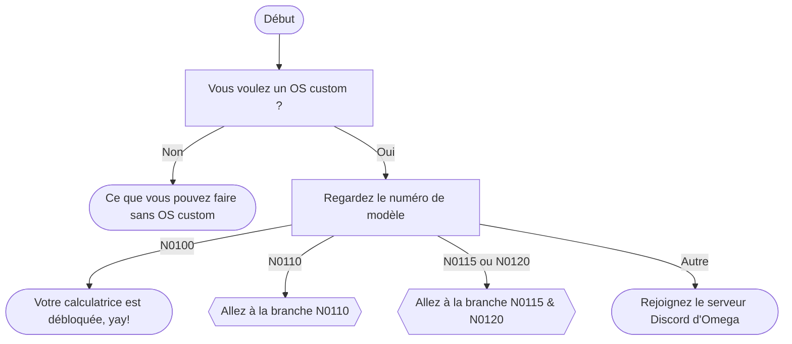
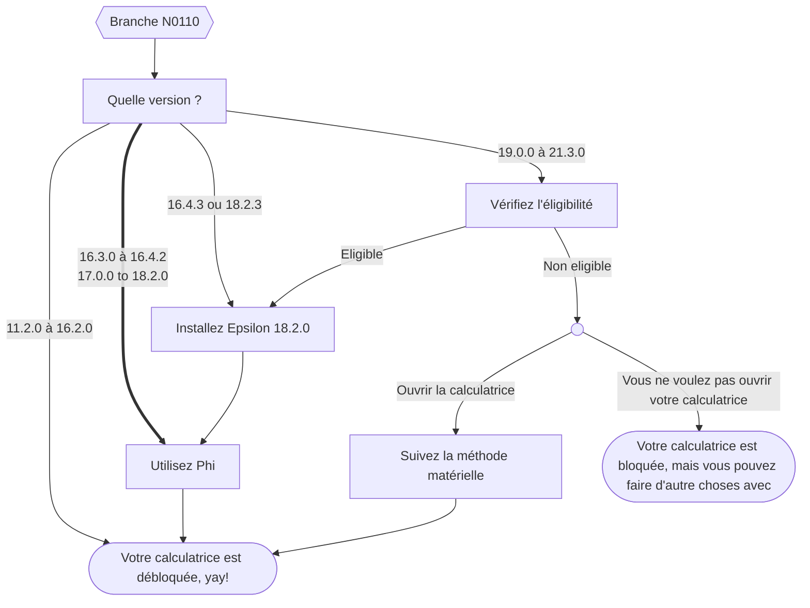
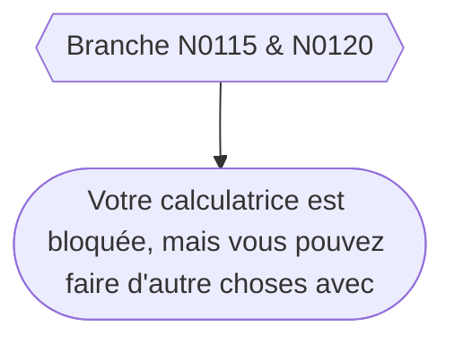

## Branche principale

```mermaid
flowchart TD
    calc_unlocked([Votre calculatrice est débloquée, yay!])
    calc_locked([Ce que vous pouvez faire sans OS custom])
    start([Début]) --> want_cfw[Vous voulez un OS custom ?]
    want_cfw --Non--> calc_locked
    want_cfw --Oui--> model_number[Regardez le numéro de modèle]
    
    
    model_number --N0100--> calc_unlocked
    model_number --N0110--> branch_N0110{{Allez à la branche N0110}}
    model_number --N0115 ou N0120--> branch_new_calcs{{Allez à la branche N0115 & N0120}}
    model_number --Autre--> goto_discord([Rejoignez le serveur Discord d'Omega])

    click model_number "./intro"
    click calc_locked "./no-custom/what-to-do-locked"
    click calc_unlocked "./cfw/choose-a-cfw"
    click goto_discord "https://discord.gg/X2TWhh9"
    click branch_N0110 "#n0110"
    click branch_new_calcs "#new-calcs"
```

## Branche N0110 {#n0110}

```mermaid
flowchart TD
    calc_unlocked([Votre calculatrice est débloquée, yay!])
    calc_locked([Votre calculatrice est bloquée, mais vous pouvez faire d'autre choses avec])
    start{{Branche N0110}} --> check_version[Quelle version ?]
    check_version --11.2.0 à 16.2.0--> calc_unlocked
    check_version ==16.3.0 à 16.4.2\n17.0.0 to 18.2.0==> phi[Utilisez Phi]
    check_version --16.4.3 ou 18.2.3--> install_18_2_0[Installez Epsilon 18.2.0]
    check_version --19.0.0 à 21.3.0--> downgrade_check[Vérifiez l'éligibilité]
    downgrade_check --Eligible--> install_18_2_0
    downgrade_check --Non eligible--> downgrade_fail(( )) --Ouvrir la calculatrice--> hardware_method[Suivez la méthode matérielle]
    downgrade_fail --Vous ne voulez pas ouvrir votre calculatrice--> calc_locked
    install_18_2_0 --> phi
    phi & hardware_method --> calc_unlocked

    click check_version "./n0110/n0110-is-locked"
    click downgrade_check "./n0110/phi/check-version-change-eligibility"
    click install_18_2_0 "./n0110/phi/install-epsilon-18-2-0"
    click phi "./n0110/phi"
    click hardware_method "./n0110/hardware/n0110-hardware-unlock"
    click calc_locked "./no-custom/what-to-do-locked"
    click calc_unlocked "./cfw/choose-a-cfw"
```

## Branche N0115 & N0120 {#new-calcs}

```mermaid
flowchart TD
    calc_locked([Votre calculatrice est bloquée, mais vous pouvez faire d'autre choses avec])
    start{{Branche N0115 & N0120}} --> calc_locked

    click calc_locked "./no-custom/what-to-do-locked"
```
