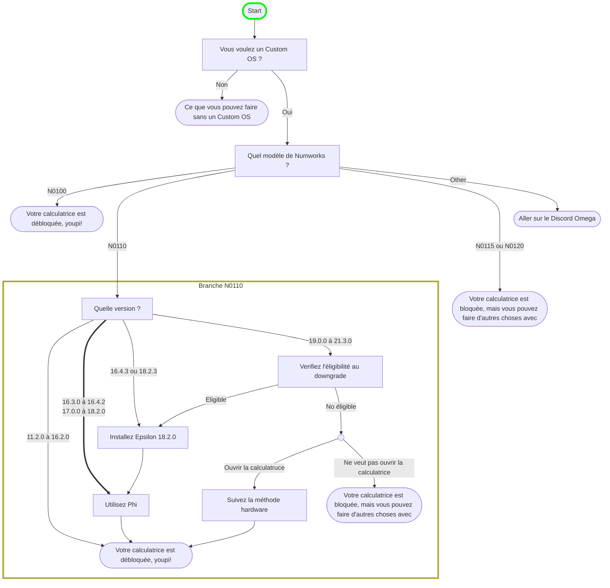

```mermaid
flowchart TD
    calc_unlocked([Votre calculatrice est débloquée, youpi!])
    calc_locked_no_modif([Ce que vous pouvez faire sans un Custom OS])
    start([Start]) --> want_cfw[Vous voulez un Custom OS ?]
    style start stroke:#00f500,stroke-width:4px
    want_cfw --Non--> calc_locked_no_modif
    want_cfw --->|Oui| model_number[Quel modèle de Numworks ?]
    
    
    model_number --N0100--> calc_unlocked
    model_number ---->|N0110| check_version_n0110
    model_number ---->|N0115 ou N0120| calc_locked_new_calcs
    model_number --Other--> goto_discord([Aller sur le Discord Omega])

    click model_number "./intro"
    click calc_locked_no_modif "./no-custom/what-to-do-locked"
    click calc_unlocked "./cfw/choose-a-cfw"
    click goto_discord "https://discord.gg/X2TWhh9"

    subgraph n0110 [Branche N0110]
    style n0110 fill:transparent,stroke-width:4px
    calc_locked_n0110([Votre calculatrice est bloquée, mais vous pouvez faire d'autres choses avec])
    calc_unlocked_n0110([Votre calculatrice est débloquée, youpi!])
    check_version_n0110[Quelle version ?]
    check_version_n0110 --11.2.0 à 16.2.0--> calc_unlocked_n0110
    check_version_n0110 ==16.3.0 à 16.4.2\n17.0.0 à 18.2.0==> phi[Utilisez Phi]
    check_version_n0110 --16.4.3 ou 18.2.3--> install_18_2_0[Installez Epsilon 18.2.0]
    check_version_n0110 --19.0.0 à 21.3.0--> downgrade_check[Verifiez l'éligibilité au downgrade]
    downgrade_check --Eligible--> install_18_2_0
    downgrade_check --No éligible--> downgrade_fail(( )) --Ouvrir la calculatruce--> hardware_method[Suivez la méthode hardware]
    downgrade_fail --Ne veut pas ouvrir la calculatrice--> calc_locked_n0110
    install_18_2_0 --> phi
    phi & hardware_method --> calc_unlocked_n0110

    click check_version_n0110 "./unlock/n0110-is-locked"
    click downgrade_check "./unlock/phi/check-version-change-eligibility"
    click install_18_2_0 "./unlock/phi/install-epsilon-18-2-0"
    click phi "./unlock/phi"
    click hardware_method "./unlock/hardware/n0110-hardware-unlock"
    click calc_locked_n0110 "./no-custom/what-to-do-locked"
    click calc_unlocked_n0110 "./cfw/choose-a-cfw"

    end

    calc_locked_new_calcs([Votre calculatrice est bloquée, mais vous pouvez faire d'autres choses avec])

    click calc_locked_new_calcs "./no-custom/what-to-do-locked"
```